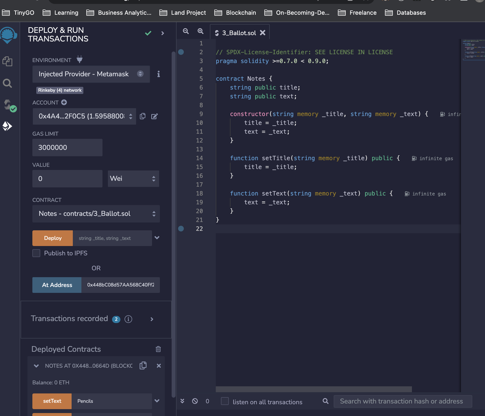

### What is this smart contract does?

- It keeps track of notes

### How is the process works?

1. Create smart contract
2. Compile the smart contract
3. Deploy and test smart contract using garnache and mocha
4. Deploy smart contract on the Rinkeby blockchain

### Tools

1. Ganache provides the test copy of the ethreum network/blockchain as well as test accounts we need for deploying the smart contract
2. Mocha provides the test framework to test our application
3. web3 allows our application to connect to the blockchain

### How to deploy the smart contract

1. Clone this repo
2. cd notes
3. npm install
4. npm run test
5. node deploy.js

### Interact with the smart contract using remix

1. goto remix.ethereum.org
2. Created a contract call Notes
3. Paste Notes.sol in the contract file
4. head to Deploy and Run transactions
   - environment: Injected Provider - Metamask
   - Account: Choose Account used to deploy smart contract
   - At address: Enter address the smart contract deployed to

